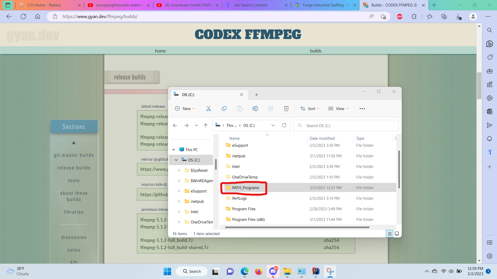

# YouTube To MP3 Converter

## Index
- [Overview](#overview)
  - [Summary](#summary)
  - [Disclaimer](#disclaimer)
  - [Instructions](#instructions)
  - [Made With](#made-with)

# Overview

⚡ A simple Node.JS YouTube to MP3 converter!

## Summary

💻 Users can use an IDE like IntelliJ to convert YouTube videos to mp3 files without having to rely on 3rd party websites.

## Disclaimer

⚠ Only download music that you have permission to. Sources such as NoCopyrightSounds, and Creative Commons sources are a few examples of places where you are allowed to use this.

## Instructions

1. Go to the FFmpeg download page at https://ffmpeg.org/download.html.
2. Download the appropriate package for your operating system.
    * For Windows, I downloaded *Windows builds from gyan.dev*
        * Download the zip file 
3. Extract the downloaded package to a location on your system.
4. Go to OS(C:)
    * Add a file called PATH_Programs 
    * Paste in these 3 executables from the *bin* folder of the zip file you extracted. 
5. Go to *Edit Environment Variables*, click *Path* then edit, and make a new variable and paste *C:\PATH_Programs*.
6. To test if everything is installed correctly, go to *Powershell* and type in `ffmpeg` and this is what it should look like 

* Audios are saved in the [Music](./Music) folder.
* Go to the *server.js* file and copy and paste the YouTube music url ID.
* Name the output file name to whatever you want.
* Then run `node server.js` in the terminal and watch the magic happen!
* *Must have Node and npm installed.*

## Made With

* Node.JS
* FFmpeg
* ytdl-core
"# YouTube-To-MP3-Converter" 
